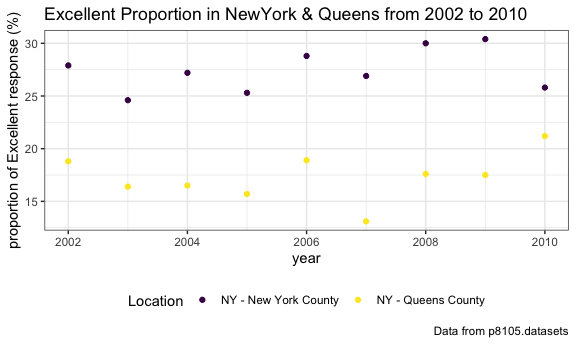

p8105\_hw2\_tl2882
================
Tian Li
2018-10-03

Problem 1
=========

``` r
data1 = read.csv("./data/NYC_Transit_Subway_Entrance_And_Exit_Data.csv") %>% 
  janitor::clean_names() %>% 
  select(line, station_name, station_latitude, station_longitude, route1:route11,
         entry, vending, entrance_type, ada) %>% 
  mutate(entry = recode(entry, "YES" = TRUE, "NO" = FALSE))
```

The variables the dataset contains are names of line, names of station, latitudes of station, longitudes of station, train of route1 to route11, entry allowed or not, with vending or not, type of entrance, ADA compliant or not.

Data cleaning steps so far include changing original variable names into reasonable names, selecting needed variables (columns), and converting the entry variable from character (YES vs NO) to a logical variable (TRUE vs FALSE).

The dimension of resulting dataset is (`1868, 19`) (the first number is the number of the rows, the second number is the number of the columns)

These data are not tidy because there are columns named route1 to route11.

Problem 1.1
-----------

``` r
data1_distinct = distinct(data1, line, station_name, .keep_all = TRUE)
nrow(data1_distinct)
```

    ## [1] 465

There are 465 distinct stations.

Problem 1.2
-----------

``` r
nrow(filter(data1_distinct, ada == TRUE))
```

    ## [1] 84

84 distinct stations are ADA compliant.

Problem 1.3
-----------

``` r
data1_withoutvending = filter(data1, vending == "NO")
sum(data1_withoutvending$entry)/length(data1_withoutvending$entry)
```

    ## [1] 0.3770492

37.70492% of station entrances / exits without vending allow entrance.

Reformat data
-------------

``` r
data1_A_distinct = gather(data1, key = route, value = train, route1:route11) %>% 
  filter(train == "A") %>% 
  distinct(line, station_name, .keep_all = TRUE)
```

    ## Warning: attributes are not identical across measure variables;
    ## they will be dropped

``` r
nrow(data1_A_distinct)
```

    ## [1] 60

``` r
nrow(filter(data1_A_distinct, ada == TRUE))
```

    ## [1] 17

60 distinct stations serve the A train.

Of the stations that serve the A train, 17 stations are ADA compliant.

Problem 2
=========

Read and tidy the Mr. Trash Wheel sheet:
----------------------------------------

``` r
library(readxl)
data2 = read_excel("./data/HealthyHarborWaterWheelTotals2017-9-26.xlsx",
                 range = cell_cols("A:N"))  %>% 
  janitor::clean_names() %>% 
  filter(!is.na(dumpster), month != "Grand Total") %>% 
  mutate(sports_balls = as.integer(round(sports_balls)))
```

Read and tidy precipitation data for 2016 and 2017:
---------------------------------------------------

``` r
prec_2016 = read_excel("./data/HealthyHarborWaterWheelTotals2017-9-26.xlsx",
                   sheet = "2016 Precipitation", range = "A2:B14")  %>% 
  mutate(year = "2016")

prec_2017 = read_excel("./data/HealthyHarborWaterWheelTotals2017-9-26.xlsx",
                       sheet = "2017 Precipitation", range = "A2:B10")  %>% 
  mutate(year = "2017")

data_prec = bind_rows(prec_2016, prec_2017) %>% 
  janitor::clean_names() %>%
  mutate(month = month.name[month])
```

In Mr.Trash Wheel dataset, the number of observation is `215`. The key variable I choose is "Dumpster".

In percipitation dataset, the number of observation is `20`. The key variable I choose is "Total".

For available data, the total precipitation in 2017 was `29.93`.

The median number of sports balls in a dumpster in 2016 was`26`.

Problem 3
=========

Install github dataset
----------------------

``` r
# install.packages("devtools")
devtools::install_github("p8105/p8105.datasets")
```

    ## Skipping install of 'p8105.datasets' from a github remote, the SHA1 (21f5ad1c) has not changed since last install.
    ##   Use `force = TRUE` to force installation

``` r
library(p8105.datasets)
```

Read and tidy brfss\_smart2010
------------------------------

``` r
brfss = brfss_smart2010 %>% 
  janitor::clean_names() %>%
  filter(topic == "Overall Health") %>% 
  select(-class, -topic, -question, -sample_size, -(confidence_limit_low:geo_location)) %>% 
  spread(key = response, value = data_value) %>% 
  janitor::clean_names() %>%
  mutate(excellent_or_verygood = excellent + very_good)
```

Problem 3.1
-----------

``` r
nrow(distinct(brfss, locationdesc))
```

    ## [1] 404

``` r
nrow(distinct(brfss, locationabbr))
```

    ## [1] 51

``` r
arrange(count(brfss, brfss$locationabbr), desc(n))
```

    ## # A tibble: 51 x 2
    ##    `brfss$locationabbr`     n
    ##    <chr>                <int>
    ##  1 NJ                     146
    ##  2 FL                     122
    ##  3 NC                     115
    ##  4 WA                      97
    ##  5 MD                      90
    ##  6 MA                      79
    ##  7 TX                      71
    ##  8 NY                      65
    ##  9 SC                      63
    ## 10 CO                      59
    ## # ... with 41 more rows

404 unique locations are included in the dataset.

All 50 states and Washington District of Columbia are represented.

New Jersey state is observed the most (146 times).

Problem 3.2
-----------

``` r
brfss_2002 = filter(brfss, year == "2002")
median(brfss_2002$excellent, na.rm = TRUE)
```

    ## [1] 23.6

In 2002, the median of the “Excellent” response value is 23.6.

Problem 3.3
-----------

``` r
ggplot(brfss_2002, aes(x = excellent)) +
  geom_histogram() + 
  labs(
    title = "Excellent response values in the year 2002", 
    x = "Excellent response values", 
    caption = "Data from p8105.datasets"
  )
```

    ## `stat_bin()` using `bins = 30`. Pick better value with `binwidth`.

    ## Warning: Removed 2 rows containing non-finite values (stat_bin).


This is the histogram of “Excellent” response values in the year 2002.

Problem 3.4
-----------

``` r
filter(brfss, locationdesc == "NY - New York County" | locationdesc == "NY - Queens County") %>% 
  mutate(excellent_proportion = excellent / (excellent + very_good + good + fair + poor)) %>%
  
  ggplot(aes(x = year, y = excellent_proportion, color = locationdesc)) + 
    geom_point() + 
    labs(
      title = "The proportion of Excellent response values in New York and Queens County from 2002 to 2010",
      y = "proportion of Excellent response values", 
      caption = "Data from p8105.datasets"
    ) + 
    viridis::scale_color_viridis(name = "Location", discrete = TRUE) + 
    theme(legend.position = "bottom")
```



This is the scatterplot showing the proportion of “Excellent” response values in New York County and Queens County (both in NY State) in each year from 2002 to 2010.
